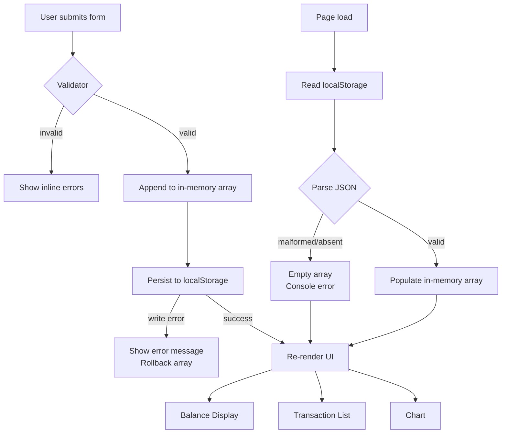

# Design Document: Expense & Budget Visualizer

## Overview

The Expense & Budget Visualizer is a zero-dependency, client-side web application delivered as three plain files: one HTML, one CSS, and one JavaScript. There is no server, no build step, and no framework. The app opens directly from the filesystem (`file://` protocol) or from any static host.

The core data flow is simple and unidirectional:

1. The user fills in the Input Form and submits.
2. The Validator checks the fields; on success the transaction is appended to the in-memory array.
3. The in-memory array is serialised to `localStorage["transactions"]`.
4. Three UI components — Balance Display, Transaction List, and Chart — are re-rendered from the in-memory array.

On page load the flow runs in reverse: the array is deserialised from `localStorage`, then all three UI components are rendered from it.



---

## Architecture

### File Structure

```
project-root/
├── index.html          ← single HTML entry point
├── css/
│   └── styles.css      ← all styling
└── js/
    └── app.js          ← all application logic
```

No other files are required. Chart.js is loaded from a CDN `<script>` tag inside `index.html`.

### Module Responsibilities (inside `app.js`)

The JavaScript file is organised into clearly separated logical sections, each with a single responsibility:

| Section | Responsibility |
|---|---|
| **State** | Single source of truth: the `transactions` array |
| **Storage** | `loadFromStorage()`, `saveToStorage()` — all `localStorage` I/O |
| **Validator** | `validateForm()` — field-level validation, returns error map |
| **Balance** | `renderBalance()` — formats and injects the total |
| **List** | `renderList()` — builds transaction rows, wires delete buttons |
| **Chart** | `renderChart()` — creates/updates the Chart.js pie chart |
| **Controller** | `init()`, form submit handler, delete handler — orchestrates the above |

All sections share the single `transactions` array. No section mutates state directly except the Controller, which calls Storage after every mutation.

### Dependency on Chart.js

Chart.js is loaded via CDN:

```html
<script src="https://cdn.jsdelivr.net/npm/chart.js@4/dist/chart.umd.min.js"></script>
```

The `app.js` script tag is placed **after** the Chart.js tag so `Chart` is available globally. If Chart.js fails to load (offline, CDN blocked), the chart canvas area shows a fallback message and the rest of the app continues to function.

---

## Components and Interfaces

### 1. Input Form (`#expense-form`)

**HTML elements:**
- `<input type="text" id="name-input" maxlength="100">` — item name
- `<input type="number" id="amount-input" step="0.01" min="0.01">` — amount
- `<select id="category-select">` — options: Food, Transport, Fun
- `<button type="submit">` — triggers validation and submission
- `<span class="error" id="name-error">`, `<span class="error" id="amount-error">` — inline error containers

**Behaviour:**
- On submit: call `validateForm()`. If errors exist, populate error spans and return. Otherwise clear errors, call `addTransaction()`, reset form.
- `addTransaction(name, amount, category)`:
  1. Build a transaction object `{ id, name, amount, category }`.
  2. Unshift into `transactions`.
  3. Call `saveToStorage()`. On failure: show storage error, splice the item back out, return.
  4. Call `renderAll()`.

### 2. Transaction List (`#transaction-list`)

**HTML element:** `<ul id="transaction-list">` inside a scrollable container `<div id="list-container">`.

**Rendered row structure:**
```html
<li data-id="{id}">
  <span class="tx-name">{name}</span>
  <span class="tx-amount">${amount}</span>
  <span class="tx-category">{category}</span>
  <button class="delete-btn" aria-label="Delete {name}">×</button>
</li>
```

**Behaviour:**
- `renderList()` clears the `<ul>` and rebuilds it from `transactions[0..n]` (already in reverse-insertion order because new items are unshifted).
- If `transactions.length === 0`, renders a single `<li class="empty-state">No transactions recorded.</li>`.
- Delete button click: call `deleteTransaction(id)`.
- `deleteTransaction(id)`:
  1. Find index, splice from `transactions`.
  2. Call `saveToStorage()`. On failure: re-insert item, show error, return.
  3. Call `renderAll()`.

### 3. Balance Display (`#balance-display`)

**HTML element:** `<span id="balance-display">$0.00</span>`

**Behaviour:**
- `renderBalance()` sums all `transaction.amount` values, formats with `formatCurrency()`, injects into the element.
- `formatCurrency(value)`:
  - Uses `Intl.NumberFormat('en-US', { style: 'currency', currency: 'USD' })` for locale-aware formatting.
  - Handles negative values natively (outputs `-$10.00`).

### 4. Chart (`#spending-chart`)

**HTML element:** `<canvas id="spending-chart"></canvas>` inside `<div id="chart-container">`.

**Behaviour:**
- `renderChart()`:
  1. If `transactions.length === 0`: destroy any existing Chart.js instance, show placeholder text, return.
  2. Aggregate totals per category: `{ Food: n, Transport: n, Fun: n }` (only include categories with total > 0).
  3. If a Chart.js instance already exists, update its `data` and call `chart.update()`. Otherwise create a new `Chart` instance.
- Category colours (fixed, WCAG-contrast-safe):
  - Food: `#E07B54` (warm orange)
  - Transport: `#4A90D9` (blue)
  - Fun: `#6DBF67` (green)

### 5. Validator

**Function:** `validateForm() → { name?: string, amount?: string }`

| Field | Rules | Error message |
|---|---|---|
| name | Non-empty after trim | "Item name is required." |
| amount | Non-empty, numeric, > 0, ≤ 2 decimal places | "Enter a positive amount (up to 2 decimal places)." |
| category | Always valid (dropdown with default) | — |

Amount validation regex: `/^\d+(\.\d{1,2})?$/` applied to the trimmed string value.

### 6. Storage Module

```
loadFromStorage() → Transaction[]
  - Read localStorage["transactions"]
  - If absent: return []
  - JSON.parse; if throws: console.error, return []

saveToStorage(transactions) → { ok: boolean, error?: Error }
  - JSON.stringify(transactions)
  - localStorage.setItem("transactions", json)
  - If throws: console.error, return { ok: false, error }
  - Return { ok: true }
```

---

## Data Models

### Transaction Object

```js
{
  id: string,        // crypto.randomUUID() or Date.now().toString() fallback
  name: string,      // 1–100 characters, trimmed
  amount: number,    // positive float, max 2 decimal places
  category: string   // "Food" | "Transport" | "Fun"
}
```

### In-Memory State

```js
let transactions = [];   // Transaction[], index 0 = most recently added
```

### localStorage Schema

```
Key:   "transactions"
Value: JSON string of Transaction[]
```

Example:
```json
[
  { "id": "1717000000001", "name": "Coffee", "amount": 4.50, "category": "Food" },
  { "id": "1717000000000", "name": "Bus fare", "amount": 2.00, "category": "Transport" }
]
```

### Category Aggregation (transient, for chart)

```js
{
  Food: number,       // sum of amounts for Food transactions
  Transport: number,  // sum of amounts for Transport transactions
  Fun: number         // sum of amounts for Fun transactions
}
```

---

## Correctness Properties

*A property is a characteristic or behavior that should hold true across all valid executions of a system — essentially, a formal statement about what the system should do. Properties serve as the bridge between human-readable specifications and machine-verifiable correctness guarantees.*

### Property 1: Serialisation Round-Trip Preserves Transaction List

*For any* list of transactions (varying names, amounts, categories, and insertion order), serialising the list to JSON and then deserialising it SHALL produce a list with the same length, and each transaction at every index SHALL have identical `id`, `name`, `amount`, and `category` values as the original.

**Validates: Requirements 5.1, 5.2, 5.5**

---

### Property 2: Balance Equals Sum of All Amounts

*For any* non-empty list of transactions, the value rendered by `renderBalance()` SHALL equal the arithmetic sum of all `transaction.amount` values, formatted as currency.

**Validates: Requirements 3.1, 3.2, 3.3**

---

### Property 3: Whitespace-Only and Empty Names Are Rejected

*For any* string composed entirely of whitespace characters (spaces, tabs, newlines), submitting it as the item name SHALL be rejected by the Validator, and the `transactions` array SHALL remain unchanged.

**Validates: Requirements 1.3**

---

### Property 4: Invalid Amount Values Are Rejected

*For any* amount value that is zero, negative, non-numeric, or has more than two decimal places, the Validator SHALL reject it and the `transactions` array SHALL remain unchanged.

**Validates: Requirements 1.5**

---

### Property 5: Adding a Transaction Grows the List by One

*For any* valid transaction and any initial state of the `transactions` array, successfully adding the transaction SHALL increase the length of the array by exactly one, and the new transaction SHALL appear at index 0.

**Validates: Requirements 1.2, 2.3**

---

### Property 6: Deleting a Transaction Shrinks the List by One

*For any* non-empty `transactions` array and any transaction in that array, deleting it by its `id` SHALL decrease the length of the array by exactly one, and no transaction with that `id` SHALL remain in the array.

**Validates: Requirements 2.4**

---

### Property 7: Chart Segments Cover 100% of Total Spending

*For any* non-empty `transactions` array, the sum of all category totals used to render the pie chart SHALL equal the sum of all `transaction.amount` values (i.e., no spending is lost or double-counted in the aggregation).

**Validates: Requirements 4.1**

---

### Property 8: localStorage Write Failure Does Not Corrupt State

*For any* `transactions` array, if `saveToStorage()` throws (simulated quota error), the in-memory `transactions` array SHALL be identical to its state before the attempted write, and the value stored in `localStorage["transactions"]` SHALL be identical to its value before the attempted write.

**Validates: Requirements 1.6, 5.6**

---

## Error Handling

| Scenario | Detection | Response |
|---|---|---|
| Empty name field | `validateForm()` | Inline error span; form not submitted |
| Invalid amount | `validateForm()` | Inline error span; form not submitted |
| `localStorage` read — absent key | `loadFromStorage()` | Empty array; no user message |
| `localStorage` read — malformed JSON | `JSON.parse` throws | Empty array; `console.error` |
| `localStorage` write — quota exceeded | `setItem` throws | `console.error`; user-visible banner; in-memory rollback |
| Chart.js CDN unavailable | `typeof Chart === 'undefined'` | Placeholder message in chart area; rest of app unaffected |
| Browser missing `localStorage` | `typeof localStorage === 'undefined'` | Unsupported-browser message; app halts gracefully |
| Browser missing `crypto.randomUUID` | Feature-detect at startup | Fall back to `Date.now().toString()` for ID generation |

---

## Testing Strategy

### Unit Tests (example-based)

Focus on specific, concrete scenarios:

- `validateForm()` with each invalid input type (empty name, zero amount, negative amount, 3-decimal amount, non-numeric amount).
- `formatCurrency()` with zero, positive, negative, and large values.
- `loadFromStorage()` with absent key, valid JSON, and malformed JSON.
- `saveToStorage()` with a mock `localStorage` that throws on `setItem`.
- `renderBalance()` with an empty array (expects `$0.00`) and a known array (expects exact formatted string).
- `deleteTransaction()` with a known ID — verifies the item is removed and the array length decreases.

### Property-Based Tests

Property-based testing is appropriate here because the core logic — serialisation, validation, balance calculation, and list mutation — consists of pure or near-pure functions whose correctness must hold across a wide input space.

**Library:** [fast-check](https://github.com/dubzzz/fast-check) (JavaScript, no build step required when loaded via CDN in a test HTML harness, or via `npm` in a Node test environment).

**Minimum iterations per property:** 100

Each property test references its design property via a comment tag:
`// Feature: expense-budget-visualizer, Property N: <property text>`

#### Property Test Specifications

| Property | Generator inputs | Assertion |
|---|---|---|
| P1: Serialisation round-trip | Arbitrary arrays of valid Transaction objects | `deserialise(serialise(arr))` deep-equals `arr` |
| P2: Balance equals sum | Arbitrary non-empty Transaction arrays | `computeBalance(arr) === arr.reduce((s,t) => s + t.amount, 0)` |
| P3: Whitespace names rejected | Strings of whitespace chars (space, tab, `\n`) | `validateForm({name: s, ...}).name` is defined (error present) |
| P4: Invalid amounts rejected | Zero, negatives, >2 decimal floats, non-numeric strings | `validateForm({amount: v, ...}).amount` is defined |
| P5: Add grows list by one | Valid transaction + arbitrary initial array | `arr.length` increases by 1; new item at index 0 |
| P6: Delete shrinks list by one | Non-empty array, pick random index | `arr.length` decreases by 1; deleted `id` absent |
| P7: Chart aggregation covers 100% | Arbitrary non-empty Transaction arrays | `sum(categoryTotals) === sum(arr.map(t => t.amount))` |
| P8: Write failure rolls back | Arbitrary array + mock throwing `setItem` | In-memory array and stored JSON unchanged after failed save |

### Integration / Smoke Tests

- Open `index.html` in each target browser; verify no console errors on load.
- Add a transaction; verify it appears in the list, balance updates, chart updates.
- Refresh page; verify transactions are restored from `localStorage`.
- Delete all transactions; verify empty-state message and `$0.00` balance.
- Simulate `localStorage` full (override `setItem` to throw); verify error message and no data loss.
- Resize viewport to 320px and 2560px; verify no horizontal scroll and no overlapping components.

### Accessibility Checks

- Run axe-core or Lighthouse against `index.html`; verify zero WCAG AA violations.
- Verify all interactive elements have accessible labels (`aria-label` on delete buttons).
- Verify colour contrast ratios meet 4.5:1 for all text/background pairs.
